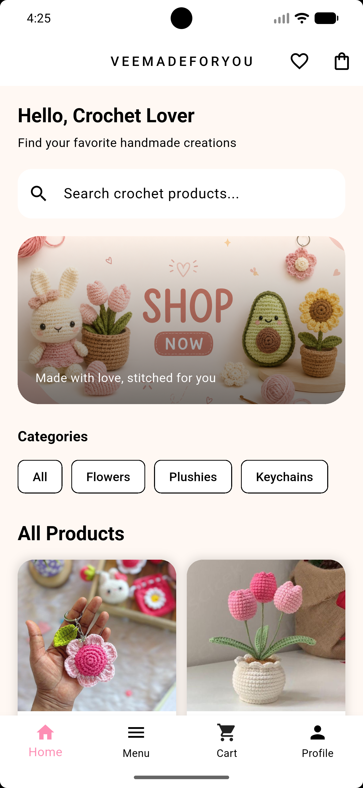
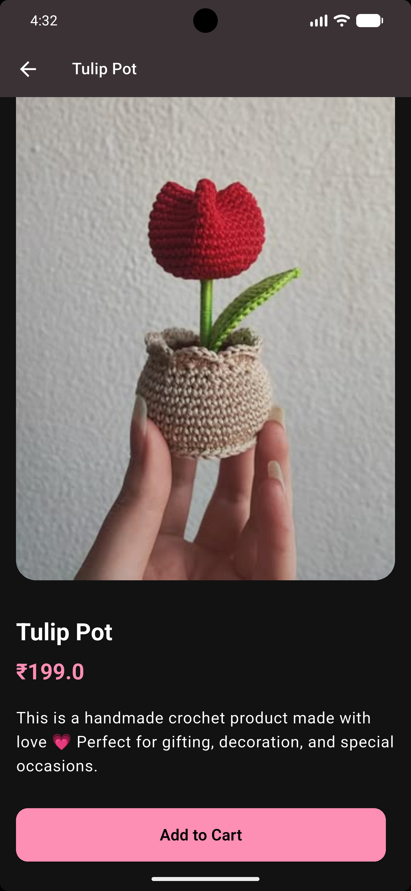
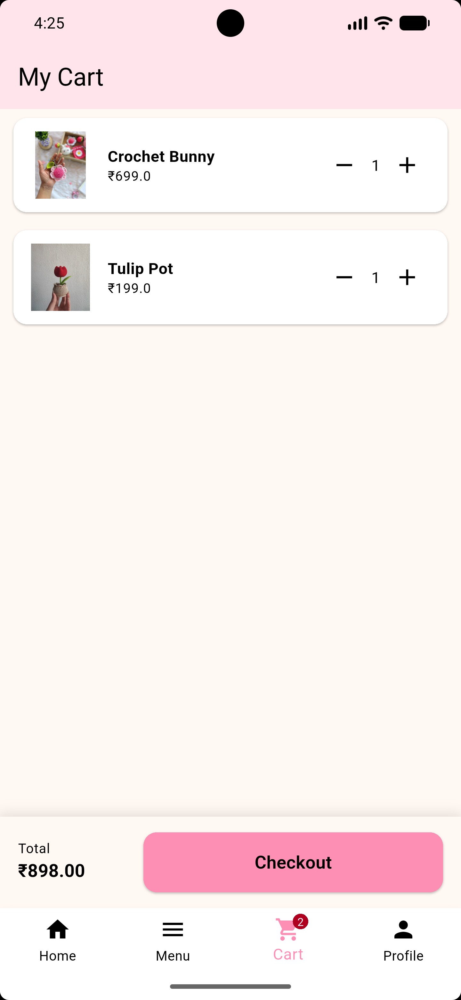
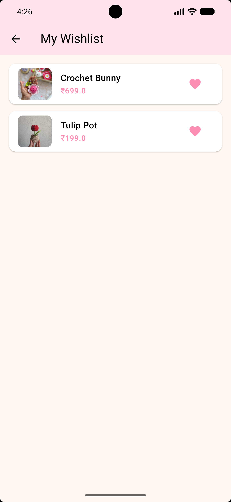
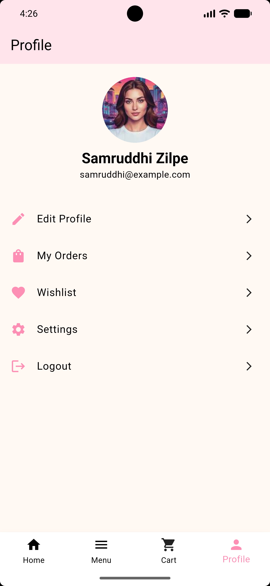
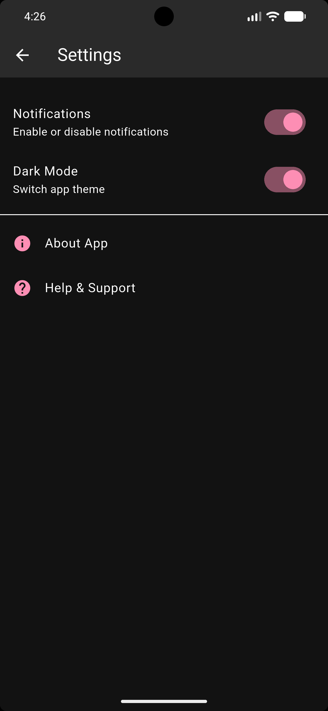

# 🧶 Crochet Shop App (Flutter)

A simple and clean e-commerce Flutter app for browsing and managing crochet products.  
Built with a focus on UI, state management, and smooth user experience.

---

## 📸 Screenshots

### 🏠 Home Screen


### 🛍️ Product Details


### 🛍️ Product 


### 🛒 Cart Screen


### ❤️ Wishlist


### 👤 Profile


### 🌗 Dark Mode


---

## ✨ Features

- 🏠 Home screen with product listing  
- 📄 Product details page  
- 🛒 Cart management  
- ❤️ Wishlist feature  
- 👤 Profile screen  
- 🌗 Light / Dark theme support  
- 🔄 Navigation across screens  

---

## 🛠️ Tech Stack

- Flutter (UI)
- Dart
- Provider / Bloc (state management)
- SharedPreferences (theme persistence - in progress)

---

## 🚀 Getting Started

```bash
git clone https://github.com/your-username/crochet_shop_app.git
cd crochet_shop_app
flutter pub get
flutter run
